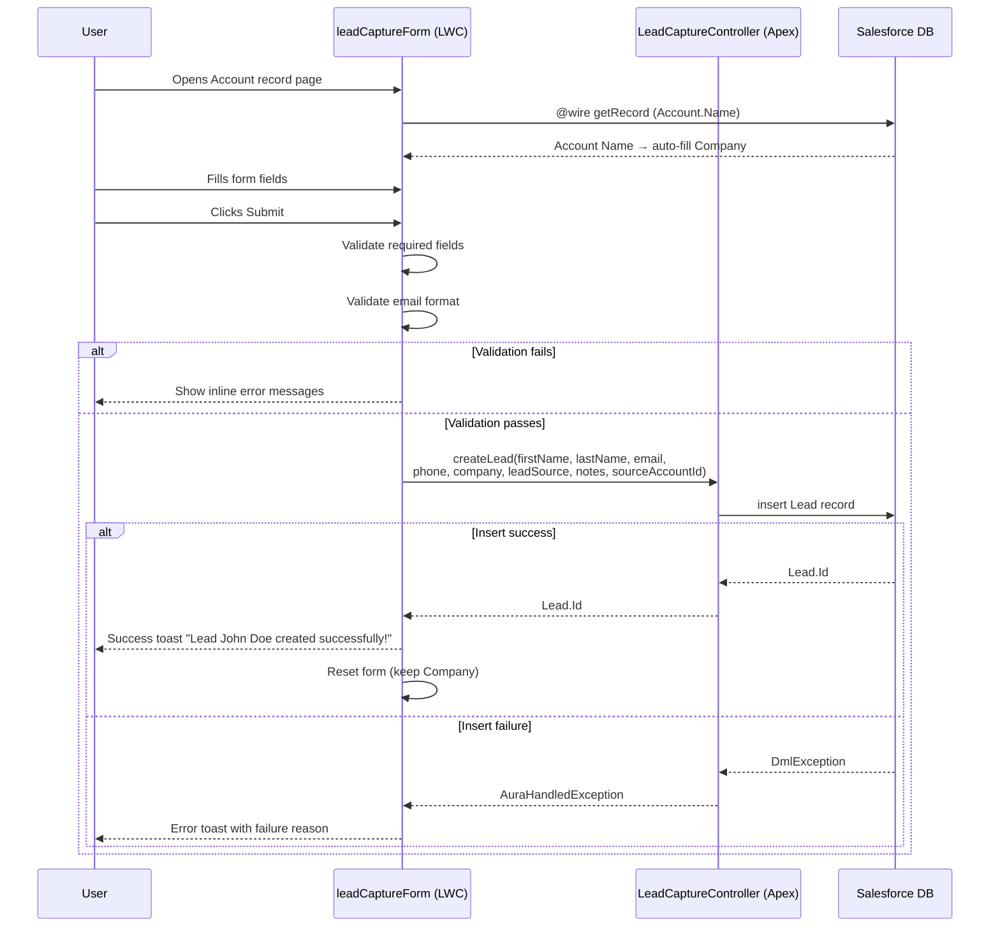

# Solution Architecture Diagram

## Component Architecture

```mermaid
graph TD
    subgraph Salesforce Org
        subgraph Lightning Record Page
            FP[Account_Lead_Capture_Page<br/>FlexiPage]
            LWC[leadCaptureForm<br/>LWC Component]
            FP --> LWC
        end

        subgraph Apex Layer
            CTRL[LeadCaptureController<br/>@AuraEnabled]
            TEST[LeadCaptureControllerTest<br/>100% Pass Rate]
        end

        subgraph Data Layer
            ACC[Account Object<br/>recordId]
            LEAD[Lead Object]
            SRC[Source_Account__c<br/>Lookup to Account]
            NOTES[Capture_Notes__c<br/>Long Text Area 500]
            LEAD --> SRC
            LEAD --> NOTES
        end

        subgraph Security
            PS[Lead_Capture_Access<br/>Permission Set]
            PS -->|Read/Create| LEAD
            PS -->|FLS Read/Edit| SRC
            PS -->|FLS Read/Edit| NOTES
            PS -->|Enabled| CTRL
        end

        LWC -->|@wire getRecord| ACC
        LWC -->|@AuraEnabled callout| CTRL
        CTRL -->|insert| LEAD
        LEAD -->|Source_Account__c| ACC
    end

    USER([User on Account Page]) --> FP
```

## Data Flow Diagram


